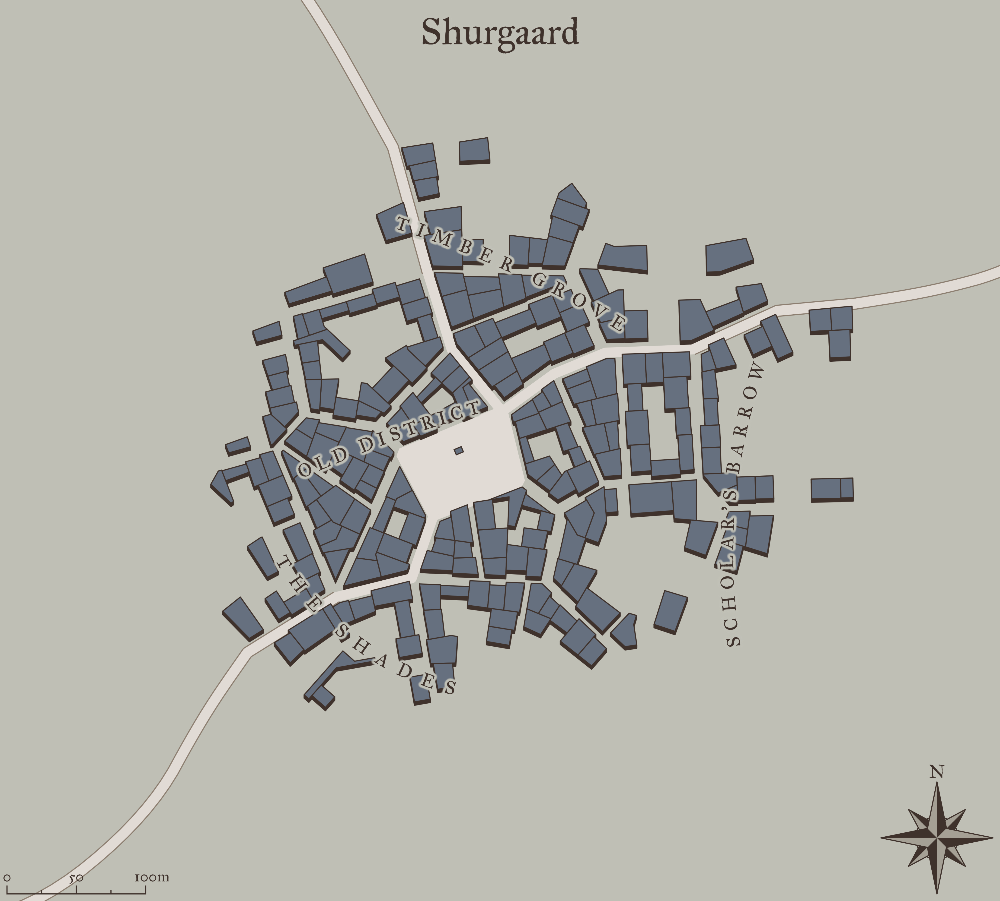
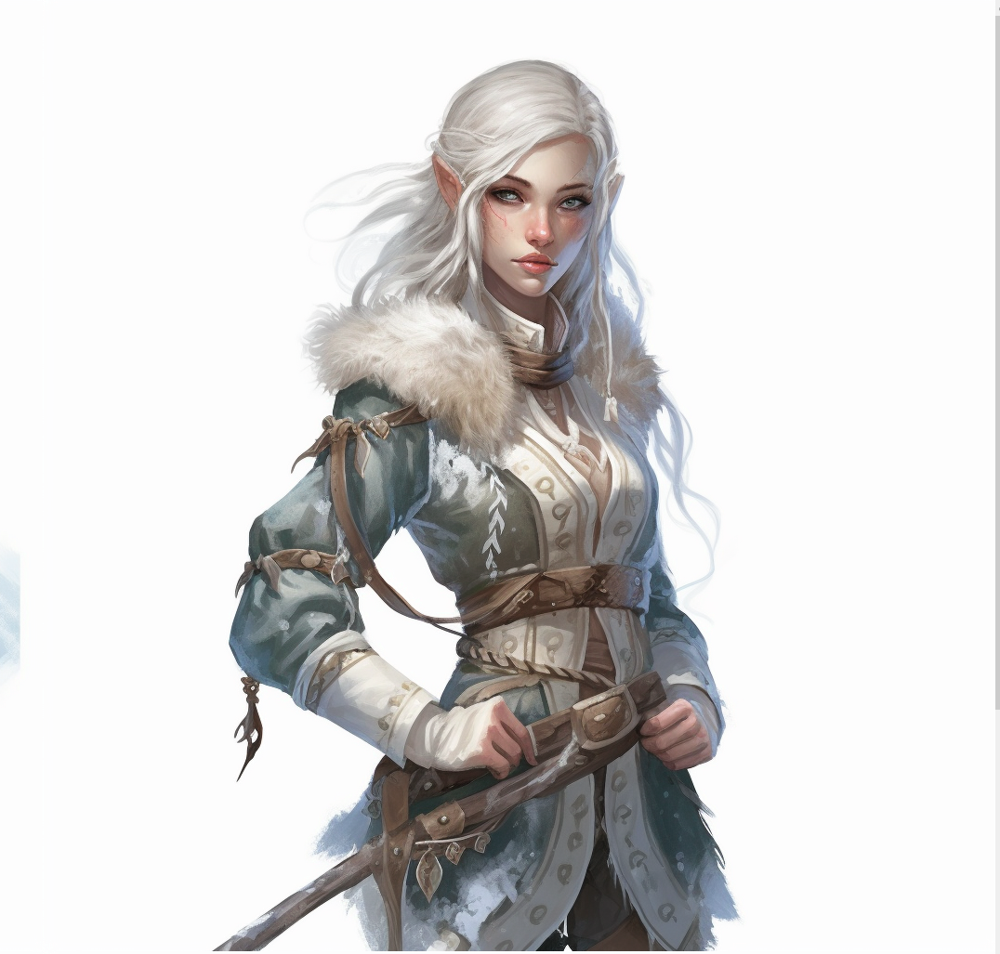
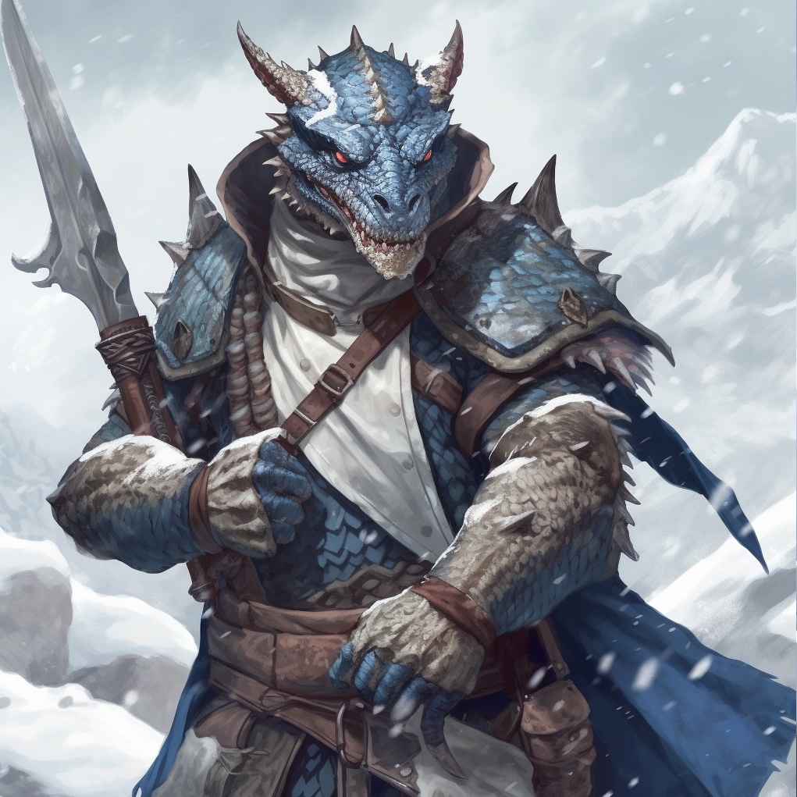
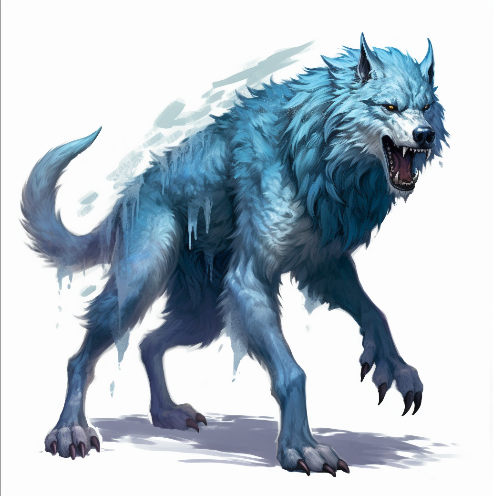
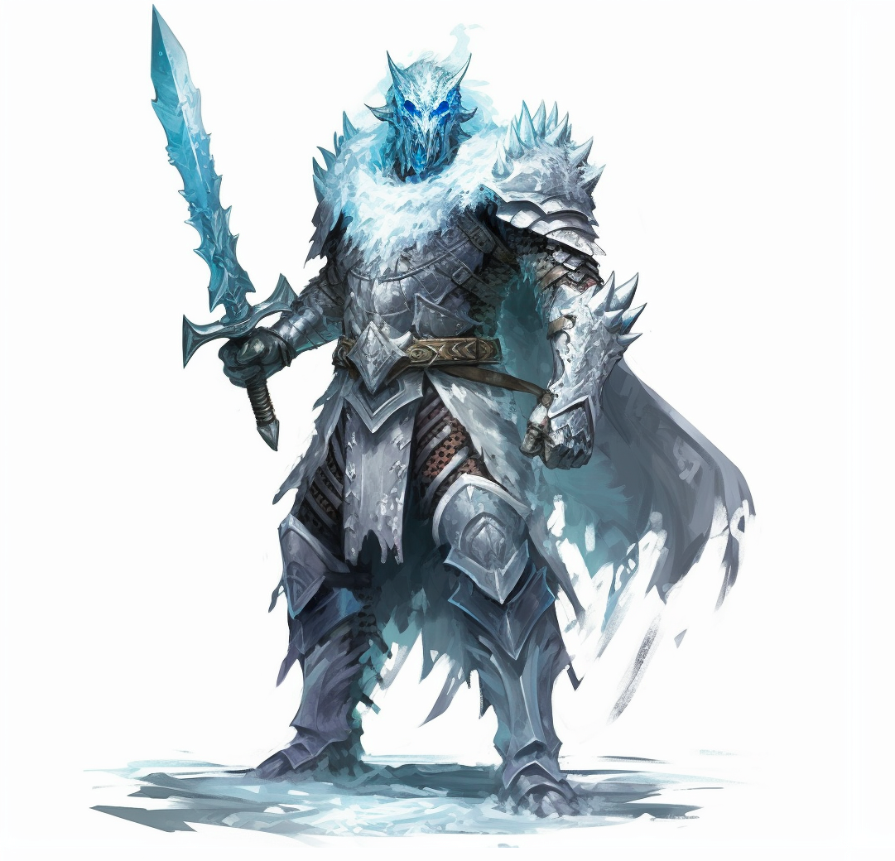
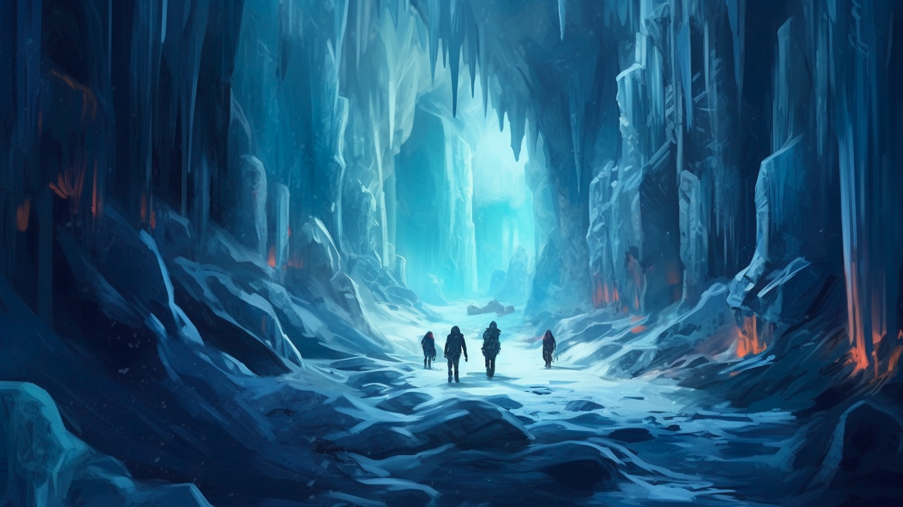
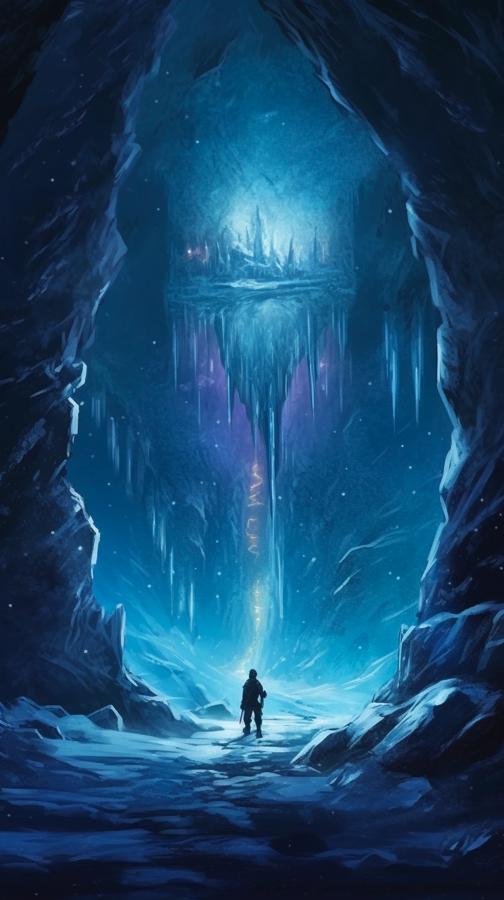
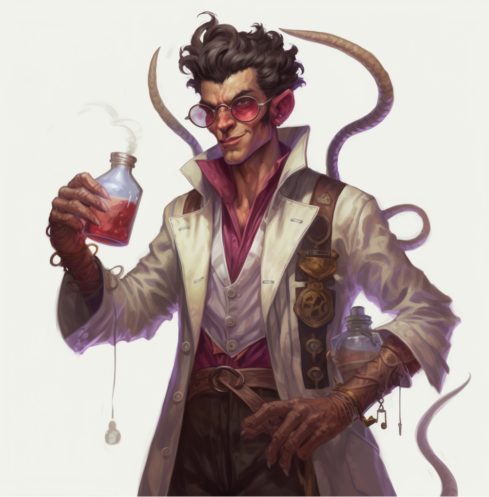
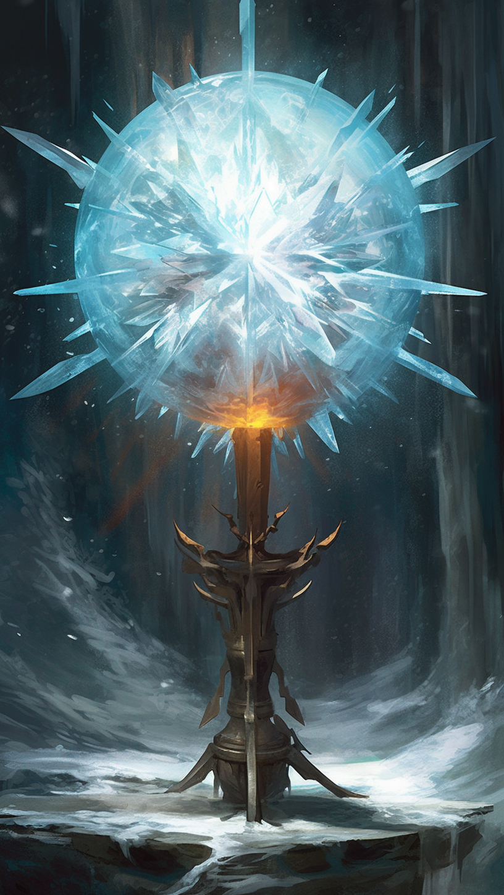

# DnD One Shot - Science of Frost

## Outline

Embark on a perilous journey through the frozen realm of Shurgaard, where an eternal winter holds sway. Unravel the mysteries that shroud the town, navigate the treacherous Frozen Forest, and confront the malevolent forces that holds the region in a chilling grip. Discover the secrets of an ancient artifact and determine the fate of Shurgaard in this thrilling one-shot adventure for D&D 5e.

# Introduction

## Phase 1

**Key Objectives**

1. Introduce the players to the town of Shurgaard and its inhabitants.
2. Provide hooks and motivations for the players to embark on the adventure.
3. Establish the presence of the eternal winter and its effects on Shurgaard.

4. Offer opportunities for the players to gather information and clues about the frozen forest and its mysteries.

**Detailed Explanation**

1. Arrival in Shurgaard: 
        1. Describe the players' arrival in the snow-covered town of Shurgaard. Paint a vivid picture of the frozen landscape, with buildings covered in icicles and townsfolk bundled up in thick furs. 
        2. Introduce the players to the town's central locations, such as the main square, the tavern, the local marketplace, and the town hall.
2. Townsfolk and Rumors:
        1. Populate Frostholm with a variety of NPCs, each with their own unique personalities and stories. Include the town mayor, a local tavern owner, a seasoned hunter, and a wise elder. 
        2. Encourage the players to interact with the townsfolk and engage in conversations. These interactions can reveal rumors, legends, and hints about the frozen forest, the eternal winter, and the artifact that controls it. 
        3. NPCs can provide quests or tasks that motivate the players to venture into the frozen forest and unravel its mysteries.
3. Observing the Effects of the Eternal Winter:
        1. Describe the effects of the eternal winter on Shurgaard. Mention the constant snowfall, icy winds, and freezing temperatures that have gripped the town. 
        2. Highlight the struggles faced by the townsfolk due to the prolonged winter, such as scarcity of resources, increased dangers from predators, and the urgent need for a solution. 
        3. Show the players the physical signs of the eternal winter, such as frozen lakes, snow-covered trees, and frost-covered structures.
4. Clues and Legends:
        1. Scatter clues and hints throughout Shurgaard that allude to the frozen forest and the artifact. These can be in the form of ancient texts, whispered legends, or mysterious symbols etched into the town's architecture. 
        2. Offer opportunities for the players to investigate and gather information from local libraries, wise elders, or even a hidden shrine dedicated to a long-forgotten deity associated with the winter.
5. Personal Motivations:
        1. Encourage the players to establish personal motivations for their characters, such as seeking a cure for a loved one affected by the eternal winter, uncovering their own mysterious connection to the artifact, or desiring to bring balance back to nature. 
        2. Allow the players to interact with each other and share their character backstories, fostering a sense of camaraderie and shared purpose.

## Elder Thora Iceheart

**Description**:

Elder Thora is an elderly woman with snow-white hair and piercing blue eyes that seem to reflect the icy landscape. She is dressed in warm furs and carries herself with a regal yet gentle demeanor. While not looking particular old, you can see in her battle worn face that shes been in this mortal realm far longer than most.

**Role**:

Elder Thora is the wise and respected leader of Shurgaard. She possesses deep knowledge of the town's history and its connection to the surrounding snowy mountains. Her main concern is the well-being of the townsfolk and finding a solution to the prolonged winter.

**Personality**:

Wise, compassionate, and determined. Elder Thora is patient and calm in her decision-making, but her resolve is unwavering when it comes to protecting her people. She values cooperation and diplomacy and believes in the power of unity to overcome challenges.

## Captain Bjorn Chilltounge

**Description:**

Captain Bjorn is a rugged and imposing figure, standing tall with a muscular build. He sports a thick blue scaly skin that seems perpetually covered in frost and wears a suit of sturdy armor adorned with ice-like patterns. His voice carries authority and confidence.

**Role:**

Captain Bjorn is the leader of Shurgaard's militia and acts as a protector of the town. He has exceptional combat skills and extensive knowledge of the surrounding snowy wilderness. He is responsible for maintaining the town's defenses and ensuring the safety of the townsfolk.

**Personality:**

Brave, stoic, and fiercely loyal. Captain Bjorn is a man of action, always ready to face any threat head-on. He believes in leading by example and inspires others with his dedication and fearlessness. He can be gruff at times, but his commitment to Shurgaard and its people is unwavering.

**Plot**

- The adventurers arrive in Shurgaard, a town struggling under the weight of a perpetual winter.
- They meet with the town's leaders who explain the dire situation and seek the party's help.
        - Elder Thora Iceheart
        - Captain Bjorn Chilltounge

# Investigating Shurgaard

**Plot**

- The party explores the town, speaking with townsfolk and gathering information.
- They learn about strange occurrences, such as sightings of icy creatures and the appearance of a mysterious ice shard.

**NPCs**

- Agnes, a worried farmer whose crops have failed due to the cold.
- Lars, a hunter who shares tales of aggressive and elusive wildlife driven down from the mountains.
- Ingrid, a young herbalist who has noticed the disappearance of certain plant species due to the frost.
- Olaf, a fisherman who laments the freezing of the nearby lake, making it impossible to catch fish.

Through conversations and investigation, the party learns about several potential leads to follow:

- The appearance of a mysterious ice shard on a nearby peak, said to possess powerful magical properties.
- Sightings of icy creatures roaming the outskirts of town, indicating a possible connection to the extended winter.
- Rumors of an ancient cave hidden in the mountains, believed to be the source of the winter's curse.

# The Frozen Forest

**Plot**

The party embarks on a journey through a dense, snowy forest towards an ancient cave rumored to be the source of the winter's curse.

They face natural hazards like icy terrain, blizzards, and dangerous creatures that have been driven closer to town due to the cold.

## Phase 1

**Navigation and Hazards:**

The party must navigate through the Frozen Forest, facing various natural hazards and challenges along the way.

The forest is filled with thickets, snow-covered branches, and hidden crevices, making progress slow and treacherous.

They may encounter freezing temperatures, icy winds, and slippery terrain that tests their survival skills and endurance.

**Wildlife Encounters:**

As the party moves deeper into the Frozen Forest, they encounter elusive and aggressive wildlife that has been driven closer to town due to the prolonged winter. The creatures, such as snow wolves or frost bears, are hungry and desperate, posing a threat to the party. The adventurers must decide whether to engage in combat, find alternative solutions, or use their survival skills to evade the creatures.

Example: The party sees a group of wolfs howling and eating the scraps of a long gone deer. They can choose to fight the pack head on or get around them by other means

[Roll20 - Compendium and Rule Set Directory](https://roll20.net/compendium/dnd5e/Winter%20Wolf#content)

## Phase 2 - This is the way

**Tracking the Way:**

The party may come across tracks or signs left by previous explorers or the creatures themselves, providing clues or possible shortcuts through the forest.

Skill checks, such as Survival or Nature, can help them discern the safest path or identify potential dangers ahead.

**Environmental Challenges:**

The Frozen Forest presents various environmental challenges that the party must overcome to progress. They may encounter frozen rivers or lakes that require finding a safe crossing, or heavy snowfall that obscures their vision and makes navigation difficult. The adventurers might need to solve puzzles, find hidden pathways, or make use of their resources and abilities to overcome these challenges.

## Phase 3 - The Entrance

**Encounters with Guardian Creatures:**

As the party delves deeper into the Frozen Forest, they may encounter powerful guardian creatures that protect the forest's secrets.

These creatures could be ancient and mystical beings, such as an ice nymph or a guardian spirit, or even corrupted entities affected by the frost.

The party must engage in combat or find alternative ways to negotiate with or bypass these guardians, potentially gaining their assistance or knowledge.

# Frostbound Sentinels Encounter

## Encounter

**Setup**

As the party approaches the entrance of the Frozen Forest, they come  face to face with the two formidable Frostbound Sentinels. The ethereal  beings stand tall, their glowing eyes fixed upon the intruders. The air  around them is bitterly cold, and the party can feel the chill seeping  into their bones. The battle to gain access to the cave entrance begins!

**Enemies:**

- 2 Frostbound Sentinels (See stat block)

**Allies:**

- None

**Terrain:**

- The encounter takes place in a clearing near the entrance of the Frozen Forest, with snow-covered ground and tall, ancient trees.
- The area provides a mix of open spaces and cover, allowing for tactical movement and positioning.

**Round-by-Round Breakdown:**

Round 1:

- Initiative is rolled.
- The Frostbound Sentinels take their turn. They activate their Chilling Aura, filling the area around them with frigid energy, requiring Constitution saving throws from the party.
- The party begins to position themselves and plan their strategy.

Round 2:

- The Frostbound Sentinels make their multiattacks, engaging the party with their longswords or launching ice shard attacks.
- The party members focus on dealing damage while trying to avoid the chilling aura and finding cover when necessary.

Round 3:

- The Frostbound Sentinels use their Legendary Action to activate Frost Nova, releasing a burst of frigid energy that damages and potentially restrains the party.
- The party adapts their tactics, using crowd control spells or abilities to mitigate the effects of Frost Nova and focusing their attacks on one Sentinel at a time.

Round 4:

- The Frostbound Sentinels continue their assault with multiattacks, aiming to wear down the party's defenses.
- The party may use their class abilities and spells strategically, targeting vulnerabilities or utilizing area-of-effect spells to damage both Sentinels simultaneously.

Round 5:

- The Frostbound Sentinels use their Legendary Action to teleport or activate Shielding Frost to protect themselves.
- The party members coordinate their attacks, concentrating their firepower on the Sentinel with the lowest hit points or exploiting openings created by the Sentinels' actions.

Round 6:

- The Frostbound Sentinels adjust their tactics based on the battle situation, using their abilities and legendary actions strategically.
- The party employs healing spells, protective buffs, and other support abilities to maintain their stamina and increase their survivability.

Round 7:

- The Frostbound Sentinels focus their attacks on weakened party members or attempt to disrupt spellcasters with their ice shards.
- The party may employ hit-and-run tactics, kiting the Sentinels while unleashing powerful attacks and avoiding the chilling aura.

Round 8:

- The party emerges victorious, with both Frostbound Sentinels shattered into icy fragments. The path to the Frozen Forest is finally open, and a sense of triumph fills the air.

Rewards:

- The party gains experience points for defeating the Frostbound Sentinels, proving their strength and resilience.
- They may find valuable treasures within the remains of the Sentinels or discover clues that deepen the mystery of the Frozen Forest.

## Frostbound Sentinel

Large elemental, neutral

**Armor Class:** 18 (natural armor) 

**Hit Points:** 120 (16d10 + 32) 

**Speed:** 30 ft., fly 60 ft. (hover)

**STR:** 18 (+4) 

**DEX:** 14 (+2) 

**CON:** 15 (+2) 

**INT:** 10 (+0) 

**WIS:** 14 (+2) 

**CHA:** 12 (+1)

**Saving Throws:** Dex +5, Con +5 Skills: Perception +6 

**Damage Resistances:** Cold 

**Damage Immunities:** Poison 

**Condition Immunities:** Exhaustion, Poisoned 

**Senses:** Darkvision 120 ft., passive Perception 16 Languages: Primordial

**Actions:**

- Multiattack: The Frostbound Sentinel makes two longsword attacks or two ranged ice shard attacks.
- Longsword: Melee Weapon Attack: +7 to hit, reach 10 ft., one target. Hit: 14 (2d8 + 4) slashing damage plus 7 (2d6) cold damage.
- Ice Shard: Ranged Spell Attack: +5 to hit, range 60 ft., one target. Hit: 11 (2d6 + 4) cold damage.
- Chilling Aura (Recharge 5-6): The Frostbound Sentinel emits a chilling aura in a 15-foot radius. Each creature that starts its turn in the aura must make a DC 14 Constitution saving throw or take 14 (4d6) cold damage. On a successful save, the creature takes half damage.

**Legendary Resistance (3/day):** 

If the Frostbound Sentinel fails a saving throw, it can choose to succeed instead.

**Legendary Actions (3/day):** 

The Frostbound Sentinel can take three legendary actions, choosing from the options below. Only one legendary action option can be used at a time and only at the end of another creature's turn. The Frostbound Sentinel regains spent legendary actions at the start of its turn.

- Frost Nova: The Frostbound Sentinel releases a burst of frigid energy, affecting all creatures within a 15-foot radius. Each affected creature must make a DC 15 Dexterity saving throw or take 14 (4d6) cold damage and be restrained for 1 round. On a successful save, the creature takes half damage and is not restrained.
- Blizzard Step: The Frostbound Sentinel teleports up to 30 feet to an unoccupied space it can see.
- Shielding Frost: The Frostbound Sentinel generates a protective barrier of ice, granting itself resistance to all damage until the start of its next turn.

**Discovery of the Cave Entrance:**

After a challenging journey through the Frozen Forest, the party eventually discovers the entrance to the ancient cave rumored to be the source of the winter's curse. The entrance could be partially concealed by snow or marked by ancient runes, indicating that they are on the right track.

# The Frost Cave

**Overall plot:**

- The adventurers enter the ancient cave, encountering icy traps and puzzles that guard the inner sanctum.
- They solve riddles or overcome challenges to progress deeper into the cave.

**Intro**:

- The party enters the Frost Cave, a vast and frigid cavern that lies hidden within the snowy mountains.

- The air is icy, and faint echoes reverberate through the chamber as they step deeper into the unknown.

- The cave is filled with shimmering ice formations, stalactites, and frost-covered walls that glisten in the party's light sources.

- The temperature drops even further within the cave, making it essential for the party to stay bundled up and protected from the cold.

## Phase 1 - It's a TRAP!?

- As the party progresses through the Frost Cave, they encounter a series of traps and puzzles left behind by the cave's original inhabitants.
- Traps could include pressure plates triggering icy spikes or frozen snares, while puzzles might involve deciphering ancient inscriptions or manipulating frozen mechanisms.
- The adventurers must rely on their perception, investigation, and problem-solving skills to bypass these obstacles safely.

# The Icy Chasm Trap

**Description:** 

As the party progresses through the Frost Cave, they come across a narrow icy chasm that stretches across the path they need to traverse. The chasm is too wide to jump across, and the depths below are filled with freezing water.

1. Crumbling Ice Platforms:The party notices a series of ice platforms, each large enough to support one person, positioned at irregular intervals across the chasm.

However, as the adventurers step onto the first platform, they notice it start to crack beneath their weight.

2. Activation Mechanism:The trap is activated when the first platform is stepped upon. The mechanism causes the ice platforms to begin crumbling one by one, slowly receding into the chasm.

3. Timing and Precision:The party must work together and time their movements precisely to cross the chasm safely.

Each party member can only occupy a platform for a limited time before it crumbles away. The timing may vary for each platform, making coordination essential.

4. Party Cooperation:The party must strategize and communicate effectively to coordinate their movements.

They can use skills like Perception or Insight to gauge the timing of the platforms or work out a pattern to cross.

5. Environmental Clues:The environment may provide clues to help the party cross the chasm.

For example, they might notice slight discolorations or cracks on certain platforms that indicate a longer lifespan before crumbling.

6. Consequences of Failure:If a party member falls into the freezing water below, they suffer damage from the icy plunge and potentially encounter icy creatures or other hazards.

The party can attempt a rescue or devise an alternative plan to retrieve their fallen comrade.

7. Reward and Progression:Upon successfully crossing the chasm, the party reaches a secure platform on the other side, leading them to the puzzle or the next phase of their journey within the Frost Cave.

## Phase 2 - Frozen Guardians

- The Frost Cave is guarded by frozen creatures or animated icy constructs that serve as protectors of the ancient secrets within.
- These guardians, such as ice golems or frost elementals, present formidable challenges to the party.
- The adventurers must engage in combat or find alternative methods, such as melting the ice or using fire-based magic, to overcome these guardians.

## Phase 3 - The Chilling Labyrinth

**Icy Labyrinths:**

- The Frost Cave consists of a complex network of tunnels, chambers, and interconnected passages.
- The party must navigate through these icy labyrinths, making choices at intersections and facing dead ends or hidden shortcuts.
- They may need to create maps, solve riddles, or follow clues to ensure they stay on the correct path toward their ultimate goal.

**Chilling Discoveries:**

- Along the way, the party uncovers remnants of the cave's history and its connection to the prolonged winter.
- They may find ancient artifacts, inscriptions, or murals that shed light on the origins of the frost elemental or reveal rituals for appeasing its power.
- These discoveries deepen the party's understanding of the challenges they face and provide potential solutions to resolve the winter's curse.

# The Frozen Key Puzzle

**Description:** 

The party enters a chamber with a massive frozen door blocking their path. The door has a keyhole, but the key itself is missing. However, there are four frozen pedestals in the room, each with a different symbol carved into the ice. A riddle is etched onto a nearby stone tablet:

Riddle: "In the depths of ice, where secrets lie, Seek the symbols to make the key comply. Four pedestals stand, each with a mark, Align them true, to banish the dark. Watch for the signs, the frost's embrace, To find the order, reveal the chase."

**Solution:**

1. The party must examine the symbols on the pedestals. Let's say the symbols are a snowflake, a mountain peak, a frozen tree, and an ice crystal.
2. Upon closer inspection, the party notices faint trails of frost emanating from each symbol. These trails lead to a particular spot on the frozen door.
3. The order in which the pedestals need to be activated corresponds to the order in which the frost trails intersect on the door. The party needs to recreate this pattern to unlock the door.
4. The party must touch or interact with each pedestal in the correct order according to the intersecting frost trails. For example, if the intersecting pattern goes from snowflake, then mountain peak, then frozen tree, and finally the ice crystal, the party should touch the pedestals in that specific order.
5. When the correct order is followed, the pedestals emit a faint glow, and the ice on the door begins to melt away, revealing the keyhole.
6. The party can now proceed by inserting the key they found elsewhere in the adventure into the unlocked door, granting them access to the next area of the Frost Cave.

## Phase 4 - Enter the Portal

Confronting the mad scientist:

At the heart of the Frost Cave, the party encounters newly built/conjured portal — the portal will lead them to the mad scientist lab on a parallell realm.

The lab where the confrontation takes place is adorned with crystalline ice formations and an oppressive cold that radiates from the device which holds the crystal.

The battle against the mad scientist is a climactic encounter, where the party must use their skills, teamwork, and magical abilities to defeat the tiefling and restore balance to the land.

# The Lab

## The Final Encounter

**Setup:**

The party finally reaches the inner sanctum of Draven Blackthorn's laboratory, a chamber filled with bubbling vats of mysterious liquids and arcane apparatuses. Draven stands at the center, surrounded by a swirling vortex of dark energy. As the party enters, he turns to face them, a wicked smile curling on his lips. The battle for Frostholm's fate begins!

**Enemy:**

- Draven Blackthorn, Tiefling Warlock Scientist (Use the stat block provided earlier)

**Allies:**

- None

**Terrain:**

- The laboratory chamber is filled with various obstacles such as bubbling vats, tables, and experimental apparatuses, providing cover and strategic opportunities for both sides.
- The swirling vortex of dark energy at the center of the room periodically releases waves of necrotic energy, dealing damage to anyone caught in its path.

**Round-by-Round Breakdown**

Round 1:

- Initiative is rolled.
- Draven Blackthorn takes his turn, activating his Fiendish Resilience and casts Armor of Agathys, enveloping himself in frosty protective magic.
- The party begins positioning themselves and assessing the situation.

Round 2:

- Draven Blackthorn takes his turn, summoning a shadow blade and attacking the nearest party member.
- The party focuses on avoiding the swirling vortex of dark energy while launching their own attacks and spells against Draven.

Round 3:

- Draven Blackthorn takes his turn, using his Eldritch Blast to strike multiple party members.
- The party employs various strategies, such as flanking Draven or attempting to disrupt his concentration with spells like Silence or Counterspell.

Round 4:

- Draven Blackthorn uses his Legendary Action to teleport to a different part of the chamber, creating distance and repositioning himself strategically.
- The party members may start utilizing their class abilities, such as the rogue's Sneak Attack or the cleric's healing spells, to gain an advantage.

Round 5:

- Draven Blackthorn takes his turn, unleashing his more potent spells like Cone of Cold or Dominate Person, testing the party's resilience.
- The party focuses their attacks and spellcasting on Draven, attempting to deplete his hit points quickly while avoiding his devastating spells.

Round 6:

- Draven Blackthorn uses his Legendary Resistance to succeed on a saving throw against a powerful disabling spell from the party.
- The party may employ crowd control abilities or spells to hinder Draven's movements and limit his spellcasting options.

Round 7:

- Draven Blackthorn, sensing his imminent defeat, activates his Warlock's Curse on a party member, focusing his attacks on the cursed target.
- The party unleashes their strongest abilities, combining their efforts to bring down Draven once and for all.

Round 8:

- The party emerges victorious, with Draven Blackthorn collapsing to the ground, defeated. The swirling vortex of dark energy dissipates, and a sense of relief fills the chamber.

Rewards:

- The party gains experience points for defeating Draven Blackthorn and saving Frostholm from his malevolent plans.
- They may find valuable spell scrolls or magic items within the laboratory that can aid them in future adventures.

## Draven Blackthorn

**Tiefling Warlock Scientist**

**Armor Class:** 17 (natural armor) 

**Hit Points:** 200 (20d10 + 90) 

**Speed:** 30 ft.

**STR:** 12 (+1) 

**DEX:** 16 (+3) 

**CON:** 14 (+2) 

**INT:** 20 (+5)

**WIS:** 12 (+1) 

**CHA:** 18 (+4)

**Saving Throws:** Wis +6, Cha +9 

**Skills:** Arcana +12, History +12, Insight +6, Investigation +12 

**Damage Resistances:** Fire 

**Damage Immunities:** Poison 

**Condition Immunities:** Poisoned 

**Senses:** Darkvision 120 ft., passive Perception 11 

**Languages:** Common, Infernal, Abyssal

**Spellcasting:** 

Draven is a 20th-level spellcaster. His spellcasting ability is Charisma  (spell save DC 17, +9 to hit with spell attacks). He has the following warlock spell slots: 

1st level (4 slots): Armor of Agathys, Hex, Mage Armor

2nd level (3 slots): Hold Person, Invisibility, Mirror Image

3rd level (3 slots): Counterspell, Fireball, Hypnotic Pattern 

4th level (3 slots): Banishment, Dimension Door, Evard's Black Tentacles 

5th level (2 slots): Cone of Cold, Dominate Person 

6th level (1 slot): Circle of Death, Globe of Invulnerability

7th level (1 slot): Finger of Death, Plane Shift

8th level (1 slot): Feeblemind, Power Word Stun

9th level (1 slot): Meteor Swarm

**Eldritch Invocations:** 

Draven has the following invocations: Agonizing Blast, Book of Ancient  Secrets, Devil's Sight, Eldritch Spear, Mask of Many Faces

**Features:**

- Dark One's Blessing: Whenever Draven reduces a creature to 0 hit points, he gains temporary hit points equal to his Charisma modifier plus his warlock level (maximum 20).
- Fiendish Resilience: Draven has resistance to damage from spells and other magical effects.
- Pact of the Tome: Draven has a Book of Shadows containing additional spells.
- Otherworldly Leap: Draven's strength allows him to jump three times the normal distance.
- Devil's Sight: Draven can see normally in darkness, both magical and nonmagical, to a distance of 120 feet.

**Actions:**

- Eldritch Blast: Ranged Spell Attack: +9 to hit, range 120 ft., one target. Hit: 10 (1d10 + 4) force damage.
- Shadow Blade: Melee Weapon Attack: +9 to hit, reach 5 ft., one creature. Hit: 14 (3d8) psychic damage.

**Legendary Actions (3/day):**

1. Eldritch Blast: Draven uses his Eldritch Blast. This action follows the same rules as described in the initial stat block.
2. Teleport: Draven magically teleports up to 60 feet to an unoccupied space he can see. This allows him to reposition himself strategically or escape from a dangerous situation.
3. Warlock's Curse: Draven designates a creature he can see within 60 feet of him. The target is cursed for 1 minute, and Draven gains a bonus to damage rolls against the cursed target equal to his proficiency bonus.

**Legendary Resistance (3/day):** 

If Draven fails a saving throw, he can choose to succeed instead.

**Aura of Shadows:** 

Draven is shrouded in an aura of darkness, granting him advantage on Dexterity (Stealth) checks and providing him with half cover (+2 bonus to AC and Dexterity saving throws) against ranged attacks and spells.

**Shadow Step:** 

As a bonus action, Draven can magically teleport up to 60 feet to an unoccupied space he can see that is in dim light or darkness.

**Eldritch Invocations:** 

Draven has the following invocations in addition to those mentioned earlier:

- Repelling Blast: When Draven hits a creature with Eldritch Blast, he can push the target up to 10 feet away from him in a straight line.
- Sculptor of Flesh: Draven can cast the Polymorph spell once using a warlock spell slot. He regains the ability to do so after a long rest.

# Restoring Balance

- After defeating the mad scientist, the party discovers a magical artifact that controls the weather.
- They learn how to use the artifact to restore balance, bringing an end to the unnatural winter and bringing hope back to Frostholm.

If the party killed the scientist they need to solve a puzzle to use the artifact

**The Frostbound Relic Puzzle**

Description: As the players explore deeper into the Frozen Forest, they stumble upon a hidden chamber adorned with intricate ice carvings. In the center of the chamber rests a pedestal with a mystical artifact known as the Frostbound Relic. This artifact has the power to control the eternal winter. However, it is locked within a puzzle mechanism that must be solved to gain control over its power. The players must decipher the puzzle's clues and manipulate the relic to progress.

**Puzzle Setup:** 

The Frostbound Relic is depicted as an ornate crystal sphere suspended above the pedestal. It emits a soft, icy glow. The players notice that the sphere has several rotating rings, each engraved with different symbols and patterns. A set of clues is inscribed on a nearby wall, guiding the players towards the correct sequence of manipulations.

**Clues:**

1. "In the realm of ice and snow, the seasons' dance you must bestow. Align the symbols, let the cycle unfold, to wield the power, brave and bold."
2. "Each symbol holds a meaning true, to the seasons they are linked, this is your clue. Summer, autumn, winter, spring, arrange them right, the balance they bring."

**Puzzle Solution:** 

The players must rotate the rings of the Frostbound Relic to align the symbols representing the four seasons in the correct order: spring, summer, autumn, winter. The solution corresponds to the natural cycle of seasons.

To manipulate the Frostbound Relic, the players must interact with the rotating rings. Each ring can be turned clockwise or counterclockwise. As they manipulate the rings, the symbols on each ring change, allowing them to align the symbols in the correct order.

**Consequences of Incorrect Attempts:** 

If the players make an incorrect attempt, the Frostbound Relic reacts, releasing a surge of icy energy that chills the chamber and causes temporary frostbite to those nearby. This serves as a warning and encourages the players to reconsider their approach.

**Successful Completion:**

Once the players align the symbols correctly, the Frostbound Relic emits a soft, steady glow, and the surrounding chamber begins to warm. The eternal winter outside the chamber starts to recede slowly. The players have gained control over the artifact, allowing them to manipulate the intensity and duration of the winter within the Frozen Forest.

**Reward:** 

Controlling the Frostbound Relic grants the players the ability to bring temporary relief from the eternal winter, granting them advantages in the Frozen Forest or potential access to previously inaccessible areas. It also opens new possibilities for interaction with NPCs and reveals deeper secrets and quests related to the winter's origin.

Remember, you can adjust the complexity and difficulty of the puzzle based on your players' preferences and the desired level of challenge. Offer hints or additional clues if needed, and reward the players' creativity and problem-solving skills.

If the party spared the mad scientist the artifact that controls the weather can be controlled much easier.

# The Return

- The adventurers make their way back to Shurgaard, where the townsfolk greet them with gratitude and relief.
- The town celebrates their victory with a feast and offers the party a reward for their heroic efforts.